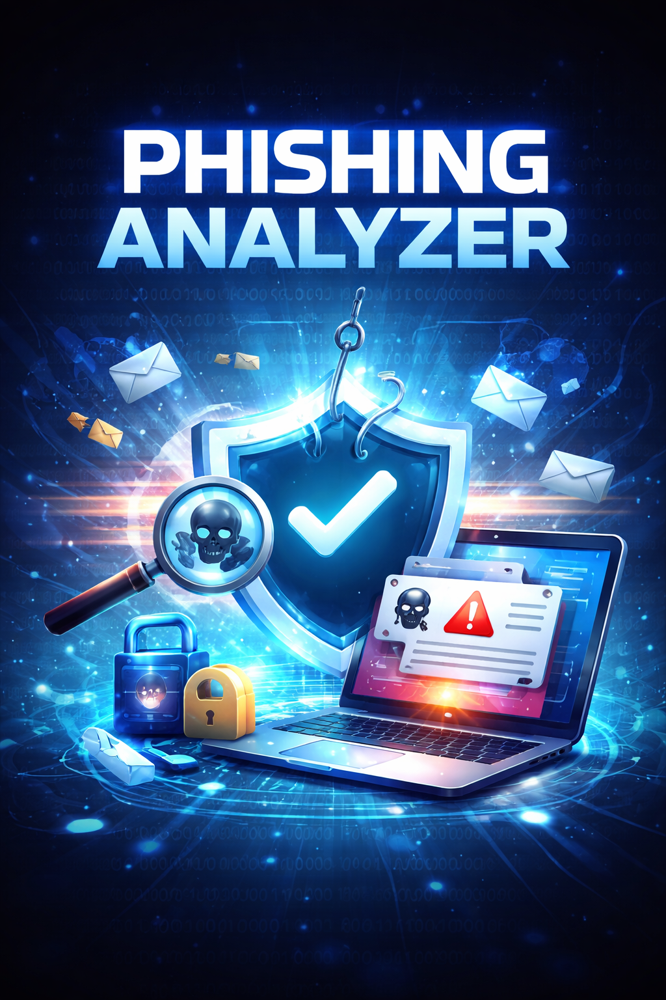
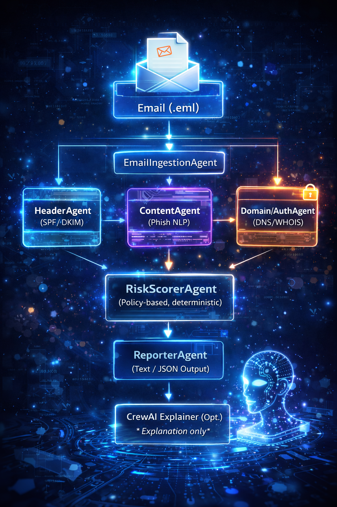

🛡️ Phishing Analyzer



This is a hybrid multi-agent phishing email analysis system, where deterministic security agents perform detection and scoring, and LLM agents are used strictly for explanation. Orchestration is handled via Prefect.

---
Real-World Cybersecurity Impact

- This system demonstrates how multi-agent AI can improve phishing detection in real-world security environments.
- Helps security teams automatically analyze suspicious emails
- Reduces manual phishing investigation time
- Provides explainable phishing risk scoring
- Allows human analysts to validate decisions before blocking emails
- The architecture reflects how modern Security Operations Centers (SOC) combine automated detection, AI reasoning, and human oversight to prevent phishing attacks safely.

---

## ✨ Key Features

✅ Deterministic phishing detection (no AI hallucinations)

✅ Email header analysis (SPF, DKIM, DMARC)

✅ Content inspection for phishing language & URLs

✅ DNS & WHOIS domain intelligence

✅ Policy-driven risk scoring

✅ Prefect-based orchestration

✅ Optional CrewAI explanation layer (non-decision-making)

✅ Fully unit-tested using pytest

✅ Python 3.11 compatible (Windows & Linux)

---

## 🧠 Architecture Overview



> **Deterministic detection first, LLM explanation second**

## 📁 Project Structure

```
phishing_analyzer_project/
│
├── phishing_analyzer/
│   ├── __init__.py
│   │
│   ├── agents/                     # Multi-agent system modules
│   │   ├── __init__.py
│   │   ├── detection_agent.py      # Detection Agent – performs phishing analysis
│   │   ├── risk_agent.py           # Risk Scoring Agent – calculates severity & action
│   │   ├── explanation_agent.py    # Explanation Agent (CrewAI) – generates AI explanation
│   │   └── human_agent.py          # Human-in-the-loop Agent – analyst validation step
│   │
│   ├── samples/                    # Sample .eml phishing emails for testing
│   ├── detector.py                 # Core detection & scoring engine logic
│   ├── guardrails.py               # Safety policies, validation & redaction
│   ├── prefect_flow.py             # Prefect orchestration for multi-agent pipeline
│   └── crewai_explainer.py         # CrewAI-based optional explanation engine
│
├── tests/                          # Unit tests (pytest)
│   ├── test_ingestion.py
│   ├── test_header_analysis.py
│   ├── test_content_analysis.py
│   ├── test_dns_auth.py
│   ├── test_domain_analysis.py
│   └── test_risk_scoring.py
│
├── images/
│   ├── title.png
│   └── architecture.png            # Architecture & cover images
│
├── requirements.txt
├── pyproject.toml
└── README.md

```
---
## 🤖 Multi-Agent Architecture

This project implements a structured multi-agent phishing detection system where specialized agents collaborate to analyze suspicious emails and generate a final security assessment.

### 1️⃣ Detection Agent
Performs deep phishing detection by analyzing:
- Email headers and sender anomalies  
- Email content and phishing indicators  
- Domain intelligence and age  
- SPF, DKIM, and DMARC authentication  

This agent produces structured technical findings from the email.

---

### 2️⃣ Risk Scoring Agent
Calculates the overall phishing risk score based on signals generated by the Detection Agent.

Responsibilities:
- Assigns phishing severity level (Low, Medium, High)  
- Determines recommended action (Allow, Flag, Quarantine, Block)  
- Produces final risk assessment  

---

### 3️⃣ Explanation Agent (CrewAI)
Generates a human-readable explanation of the phishing analysis for security analysts and non-technical stakeholders.

- Uses CrewAI to simulate a SOC security analyst  
- Explains why an email was classified with a given risk  
- Improves transparency and interpretability  

This agent is optional at runtime but remains an integral part of the multi-agent architecture.

---

### 4️⃣ Human Review Agent (Human-in-the-Loop)
Implements a human validation step before final action is taken.

- Allows a security analyst to approve, block, or escalate  
- Prevents fully autonomous decision-making  
- Ensures safe deployment in real-world environments  

---

### 🔄 Orchestration
All agents are orchestrated using a Prefect workflow that coordinates execution, ensures reliability, and manages the end-to-end phishing analysis pipeline.

---

## 🚀 How It Works

### 1️⃣ Email Ingestion

- Parses .eml files
- Extracts headers, body text, URLs, attachments
- Sanitizes content to prevent unsafe processing

### 2️⃣ Deterministic Analysis

- Headers: SPF / DKIM / DMARC validation & anomalies
- Content: Urgent language & link presence
- Domain: WHOIS age detection
- DNS Auth: SPF / DMARC / DKIM record presence

### 3️⃣ Risk Scoring

- Weighted policy-based scoring
- Produces:
 - Risk score
 - Severity
-Recommended action

###  4️⃣ Reporting

- Generates a structured, human-readable report
- PII-safe with automatic redaction

### 5️⃣ Optional AI Explanation (CrewAI)

- Reads the final report
- Produces analyst-style explanation
- Gracefully skips if CrewAI is not installed

❌ Never affects detection or scoring
---
## ⚙️ Installation
### Requirements

Python 3.11 (recommended)

### Install Dependencies
```bash
python -m pip install -r requirements.txt
python -m pip install -e .
```
CrewAI is optional. Uncomment it in requirements.txt only if required.
---
## ▶️ Running the Analyzer
```bash
C:\Python311\python.exe -m phishing_analyzer.prefect_flow --eml phishing_analyzer/samples/phish_high_confidence.eml
```
---
## 🧪 Testing

Run all unit tests:

```bash
python -m pytest -v
```

Tests cover:
 - Email ingestion
 - Header anomaly detection
 - Content analysis logic
 - DNS / WHOIS handling
 - Policy-based risk scoring
---

## 📤 Sample Output (High‑Confidence Phishing)

### Input

samples/phish_high_confidence.eml

```
================ FINAL REPORT ================

1️⃣ EXECUTIVE SUMMARY
This email shows strong indicators commonly associated with phishing attacks.

2️⃣ FINAL VERDICT
Decision: Block

3️⃣ RISK SCORE
Score: 36
Severity: High

4️⃣ KEY FINDINGS
- Header issue: SPF failed
- Header issue: DMARC failed
- Content indicator: Urgent or credential-harvesting language detected
- Domain age: Unable to determine
- Authentication issue: SPF missing
- Authentication issue: DMARC missing
- Authentication issue: DKIM missing

5️⃣ EVIDENCE
From Email: alert@goog1e-security.com
From Domain: goog1e-security.com
SPF Result: fail
DKIM Result: missing
DMARC Result: spf=fail dkim=none dmarc=fail

6️⃣ SUGGESTED ACTION
Do NOT interact with this email. Block sender and report to security.

================ AI EXPLANATION ================

{'status': 'skipped', 'reason': 'CrewAI not installed'}

```

---

## 🧠 Design Principles

- Deterministic security logic first
- LLMs used only for explainability
- Fail-safe risk elevation
- SOC-aligned architecture
- Strong guardrails & sanitization
- High test coverage

---

## 📌 Future Enhancements

- Batch email analysis
- JSON / PDF report export
- GitHub Actions CI
- Docker support
- Threat intelligence feeds (VirusTotal, Talos)

---

## 📜 License

MIT License

---
